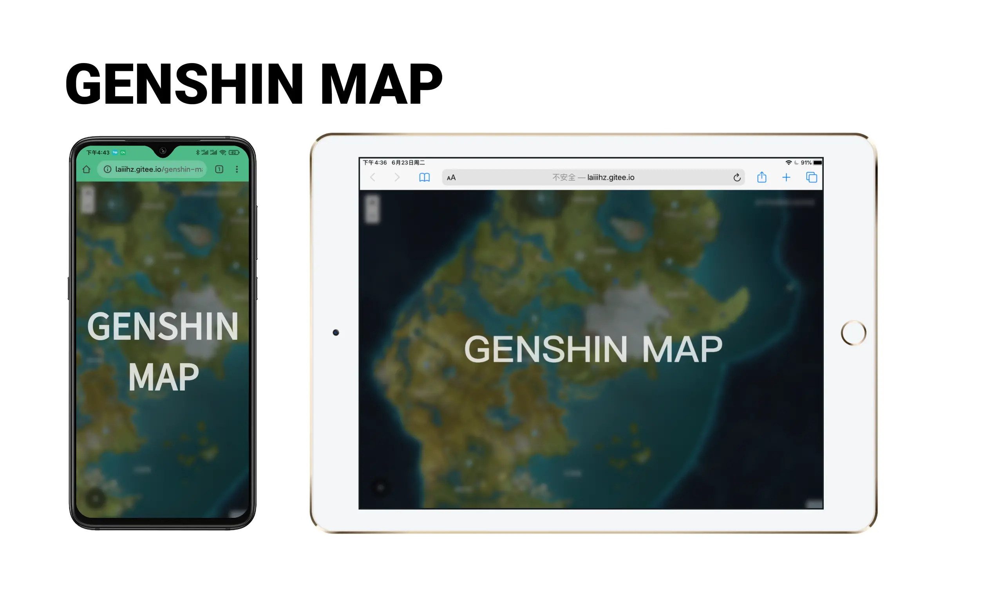

# genshin-map


## Website
[中文用户地图](http://laiiihz.gitee.io/genshin-map-web)

[English Users'map(not release)](#)
## Project setup
```
yarn install
```

### Compiles and hot-reloads for development
```
yarn serve
```

### Compiles and minifies for production
```
yarn build
```

### Lints and fixes files
```
yarn lint
```

